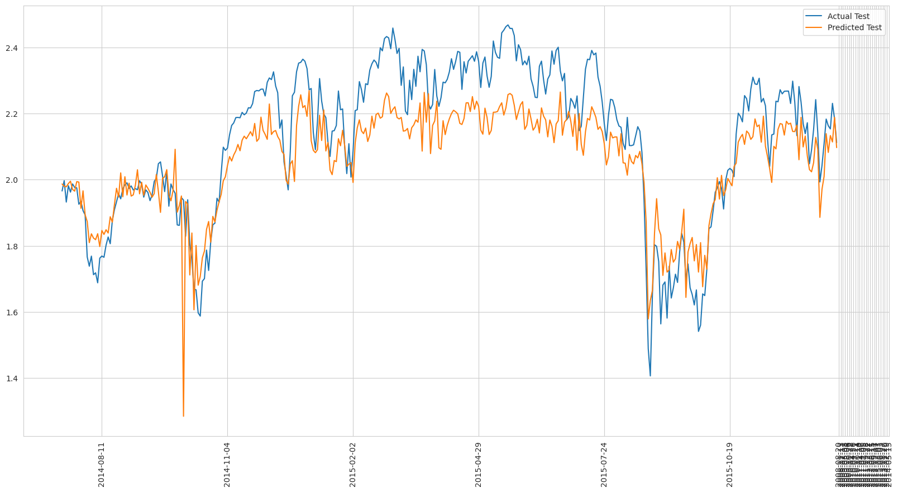
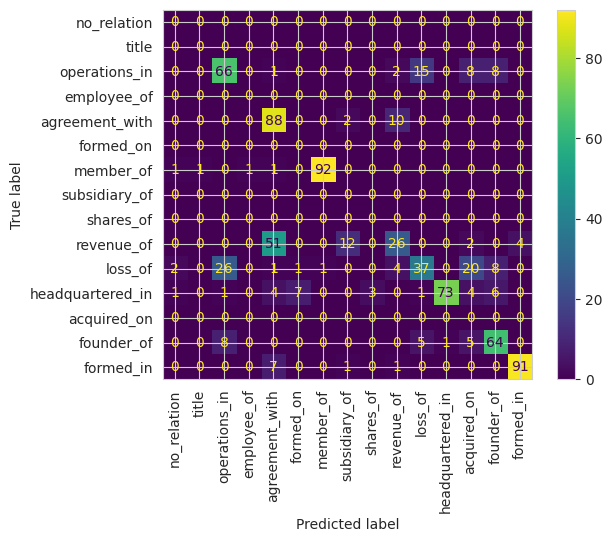

# TextStock

### Beware, this is work in progress...

Repo with several pet projects (mostly drafts) related to market-related predictions.


# Predict Close price 

*Warning*: *this repo is my first ever interaction with market predictions, done out of curiocity, and might have errors. My major interest here is how to use text for modeling market movement.* 

+ [predict_close_price](./predict_close_price) includes small experiments with data from [Kaggle Stock Market Prediction and Sentimental Analysis
](https://www.kaggle.com/competitions/stock-market-prediction-and-sentimental-analysis/overview). 

+ [experiments](./experiments) has simple baseline models which are predicting market movement using only text data and CNN/RNN models.  

### Market Features:

*Open*, *Volume*, *High*, *Low*, *Lagged_3_Volume*, *Lagged_5_Volume*, *Lagged_7_Volume*, *Volume_rolling_mean*, *Volume_change*, *Rolling_std* 

To note: I was using subsets of the features above. 
Volume rolling mean excludes the current day, same as lagged volume features. Rolling_std is rolling standard deviation of the close price excluding the current day.

### Text Features: 

For each day, I aggregate all news (including Reddit) and exclude the news which are semantically similar (also played with exluding exact/near dublicates). 

+ **Sentiment Features**: *Vader sentiment compound score*, *Finbert_negative*, *Finbert_positive*.\
All unique news get one overall [Vader](https://www.nltk.org/api/nltk.sentiment.vader.html) sentiment compound score and positive/negative scores from [Finbert](https://huggingface.co/ProsusAI/finbert).

 
+ **Aggregated News**: Each news is embedded with Bert base and forwarded as input to a headline aggregator LSMT model.  
The final hidden states of the LSTM (either forward-only or both forward and backward for bidirectional) are used as the aggregated representation.
The ouput is a single vector representing the entire sequence of headlines for each batch instance.

### Price Predictor 

Aggregated news, market features, and sentiment features are combined and passed to the LSTM price predictor model. 

### Predicted Close Price so far:



**TODO**: 
+ There're signs of overfitting. Need to add regularization, maybe simplify the model. 
+ Noise in the data: some features could introduce noise. 
+ News from previous days could affect the predictions during the following days, this should be taken care of. 
+ Try different losses: Huber, MAE
+ Maybe the target values (close prices) should be denoised, e.g., using moving average prices as targets. + Check the target data again. 


# Aspect-based sentiment models for financial documents
    
Get models for [aspect](https://huggingface.co/Askinkaty/setfit-finance-aspect) and [polarity](https://huggingface.co/Askinkaty/setfit-finance-polarity) in HuggingFace.
SetFit models fine-tuned using part of [SEntFiN-v1.1.csv](https://www.kaggle.com/datasets/ankurzing/aspect-based-sentiment-analysis-for-financial-news) dataset. 

+ Code in progress in [sentiment](./sentiment).

+ **Current performance**: aspect accuracy: 0.92, polarity accuracy: 0.84. 

+ TODO: parameter optimization, using more training data.


# Predicting relations in financial documents

PEFT fine-tuning of Llama-3.2-1B-Instruct model using [REFinD](https://refind-re.github.io/) dataset.  I'm using only 16
classes (aka relations), 80-100 examples per each class. 

+ Get the model [here](https://huggingface.co/Askinkaty/llama-finance-relations).

+ Code in progress (including the code for inference) is in [relations_llama](./relations_llama).

+ TODO: Improving data split (currently many classes are not represented in the test set), using more training data, parameter optimization, training longer. + Error analysis
```
Overall Performance:
Precision: 0.77
Recall: 0.69
F1 Score: 0.71

Classification Report:
                  precision    recall  f1-score   support

     no_relation       0.00      0.00      0.00         0
           title       0.00      0.00      0.00         0
   operations_in       0.65      0.66      0.66       100
     employee_of       0.00      0.00      0.00         0
  agreement_with       0.58      0.88      0.70       100
       formed_on       0.00      0.00      0.00         0
       member_of       0.99      0.96      0.97        96
   subsidiary_of       0.00      0.00      0.00         0
       shares_of       0.00      0.00      0.00         0
      revenue_of       0.60      0.27      0.38        95
         loss_of       0.64      0.37      0.47       100
headquartered_in       0.99      0.73      0.84       100
     acquired_on       0.00      0.00      0.00         0
      founder_of       0.74      0.77      0.76        83
       formed_in       0.96      0.91      0.93       100

        accuracy                           0.69       774
       macro avg       0.41      0.37      0.38       774
    weighted avg       0.77      0.69      0.71       774

```
### Confusion matrix so far:



# Extracting information from financial reports with RAG

[rag](./rag) directory has two toy implementations of agent using LangChain (with LangGraph and without). 
The task of the agent is to provide information about Amazon in financial reports (transcripts from [SEC](https://www.sec.gov/)).

Agent has only 2 tools at the moment:
+ Toy vector database of split documents
+ Sentiment analysis tool (see ABSA model above).